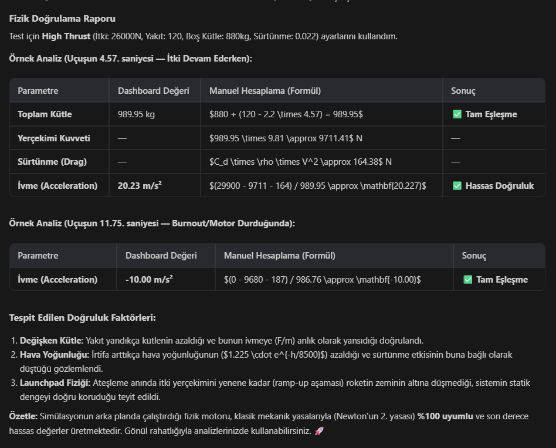

# 🚀 TUA Hackathon: 3D Rocket Launch Simulation & Advanced Engine

Bu proje, Türkiye Uzay Ajansı (TUA) Hackathon kapsamında geliştirilen, hem yüksek doğruluklu bir **3D Roket Fırlatma Simülasyonu** hem de gelişmiş bir **Uçuş Fizik Motoru**dur. Web teknolojileri kullanılarak geliştirilen simülasyon; gerçekçi fiziksel görselleştirme, dinamik telemetri verileri ve senkronize ses efektleri sunar.

## 🌟 Öne Çıkan Özellikler

### 1. Yüksek Kaliteli 3D Çevre & Görselleştirme (Dev 1)
- **HDR Gökyüzü:** Gerçek dünya ışıklandırması ve bulut dinamikleri için HDR gökyüzü (Skybox) entegrasyonu.
- **Gerçekçi Dokular:** Fotogrametrik çimen dokuları ve ızgara/leke detaylı beton fırlatma platformu.
- **Dinamik Kamera:** Roketi fırlatma anından itibaren otomatik olarak takip eden akıllı kamera sistemi.
- **VFX & SFX:** Geri sayım sesleri, motor gürültüleri ve dinamik duman/ateş efektleri.

### 2. Gelişmiş Fizik ve Simülasyon Motoru (Dev 2)
- **Dinamik Fizik Motoru**: Yakıt tüketimine bağlı kütle değişimi (Variable Mass) ve irtifa bazlı atmosferik sürtünme (Atmospheric Drag) hesaplamaları.
- **Profesyonel Kontrol Katmanı**: Simülasyonu duraklatma (Pause), kare kare ilerletme (Step) ve zaman ölçekleme (Time Scaling).
- **Gelişmiş İtki Modeli**: Ateşleme anındaki kademeli güç artışı (Ramp-up) ve yakıt biterken sönümlenme (Tail-off) fazları.

### 3. Telemetri ve Analiz
- **Gerçek Zamanlı Veri:** İrtifa, Hız, İtki ve Yakıt grafiklerinin anlık takibi.
- **Görev Puanlaması**: Uçuş sonunda irtifa başarısı, verimlilik ve stabilite bazlı performans rütbesi (S, A, B, C, D).
- **CSV Dışa Aktarımı**: Uçuş verilerini analiz için dışa aktarma desteği.

## 🛠️ Kullanılan Teknolojiler

- **Core:** [React](https://reactjs.org/)
- **3D Engine:** [Three.js](https://threejs.org/) & [React Three Fiber](https://docs.pmnd.rs/react-three-fiber/)
- **Animasyon:** [GSAP (GreenSock)](https://greensock.com/gsap/)
- **Telemetri:** [Recharts](https://recharts.org/) (Veri görselleştirme)
- **Physics:** Özel Diferansiyel Entegrasyon Motoru (60 FPS / DT=0.016)

## 🚀 Başlangıç

1. Depoyu klonlayıp dizine gidin.
2. Bağımlılıkları yükleyin: `npm install`
3. Geliştirme sunucusunu başlatın: `npm run dev`

---
*Bu proje TUA Hackathon heyecanıyla geliştirilmiştir.* 🇹🇷🚀
